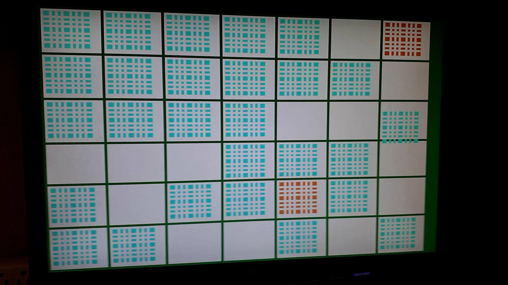

# CSC258: Computer Organization

This repository contains a capstone project from CSC258: Computer Organization course taken at University of Toronto St. George.

## PlotFour
A project done in pairs, where I was responsible for all Video Graphics Array (VGA) components of the project. I had to implement a 6x7 game board where game pieces would plot to their respective coordinates. The coordinates were provided through switches on a DE1-SoC Board as binary values.

## Interface

